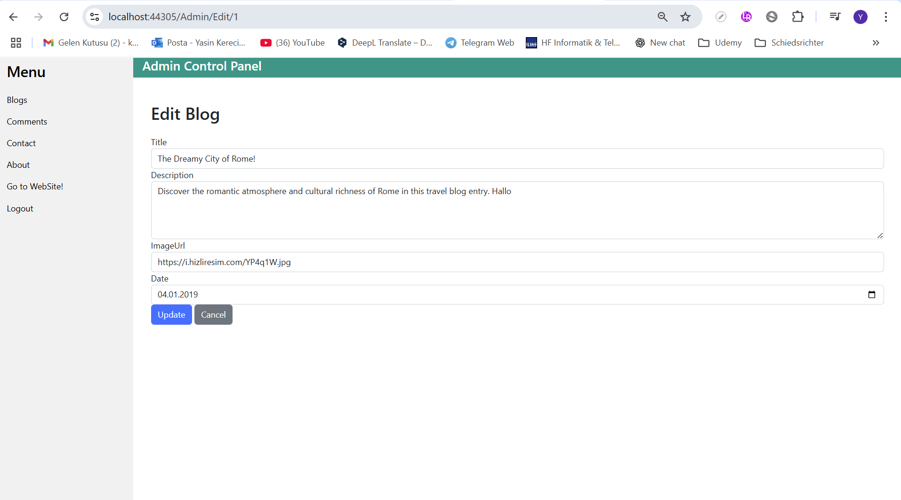

# 🧳 TravelTripProject

**TravelTripProject** is a full-featured travel blog web application built using **ASP.NET MVC 5** and **Entity Framework**.  
It allows visitors to explore travel posts and leave comments, while providing administrators a secure backend panel for managing content.

---

## 📸 Screenshots

### 🌍 Home Page


### 📝 Blog Details & Comments




### 🔐 Admin Login


### 📋 Admin - Blog List


### 💬 Admin - Comments


---

## 🚀 Features

### 🧭 Public Site
- View all blog posts with images and dates
- View detailed blog content
- Post comments (Name, Email, Content)
- Responsive UI with W3.CSS & Bootstrap

### 🔒 Admin Panel
- Admin authentication (login & logout)
- Blog CRUD (Create, Read, Update, Delete)
- Comment management (View, Edit, Delete)
- Dynamic dashboard with table views

---

## ⚙️ Technologies Used

- ASP.NET MVC 5
- Entity Framework 6
- SQL Server LocalDB
- LINQ & Lambda Expressions
- Bootstrap 3 / W3.CSS
- Forms Authentication
- HTML5, CSS3

---

## 🛠️ Setup Instructions

### 1. Clone the Project

```bash
git clone https://github.com/your-username/TravelTripProject.git
